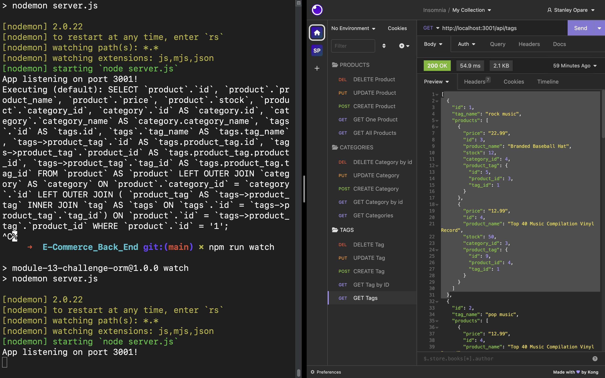

  # E-Commerce Back End

  ## Description
  **E-commerce** has always existed but its growing rate could probably be attributed to the SARS Covid-19 pandemic which occured in 2019. With many lockdowns and fear by the population for the virus, many turned to shoppinng online to avoid coming in contact with possible carriers. It was extimated to have generated about US$2.54 trillion in a 2021 data from he United Nations Conference on Trade and Development. This industry deos not seem to have and end in site as it is very convenient for shoppers and traders alike.

  This project is focused on managing the database of products, with their tags and categories by configuring a working [Express.js](https://expressjs.com/) API to use [Sequelize](https://sequelize.org/) to interact with a [MySQL2](https://dev.mysql.com/doc/) database.

  ## Table of Contents
  - [User Story](#UserStory)
  - [Acceptance Criteria](#AcceptanceCriteria)
  - [Usage](#Usage)
  - [Appearance and Functionality](#Appearance&Functionality)
  - [Questions](#questions)
  - [Credits](#Credits)

  ## User Story

  ```md
  AS A manager at an internet retail company
  I WANT a back end for my e-commerce website that uses the latest technologies
  SO THAT my company can compete with other e-commerce companies
  ```

  ## Acceptance Criteria

  ```md
  GIVEN a functional Express.js API
  WHEN I add my database name, MySQL username, and MySQL password to an environment variable file
  THEN I am able to connect to a database using Sequelize
  WHEN I enter schema and seed commands
  THEN a development database is created and is seeded with test data
  WHEN I enter the command to invoke the application
  THEN my server is started and the Sequelize models are synced to the MySQL database
  WHEN I open API GET routes in Insomnia for categories, products, or tags
  THEN the data for each of these routes is displayed in a formatted JSON
  WHEN I test API POST, PUT, and DELETE routes in Insomnia
  THEN I am able to successfully create, update, and delete data in my database
  ```

  ## Usage
  Run the application using the following command:
  In your terminal, navigate to your repository and run the following to install all necessary dependencies
  ```sh
  npm i
  npm install express
  npm install mysql2
  npm install sequelize
  ```
  Next navigate to db folder by running and use mysql to run schema.sql file. **Note:** You will require password to run mysql.
  ```sh
  cd db
  mysql -u root -p
  source schema.sql
  exit
  ```
  Navigate back to the parent repository to run the seed and the server.
  ```sh
  cd ..
  npm run seed
  npm run watch
  ```

  ## Appearance and Functionality 
  Click on [E-Commerce Back End](https://watch.screencastify.com/v/aUTRh5Hgab2AN2k0a5Be) to watch the video walkthrough.

  
  ## Questions
  For any questions or suggestions, feel free to reach out to me on GitHub: [StanOp09](https://github.com/StanOp09) or via email: stanleykaopare@gmail.com.

  ## Credits
  - Sean Roshan
  - [Express.js](https://expressjs.com/)
  - [Sequelize](https://sequelize.org/)
  - [MySQL2](https://dev.mysql.com/doc/)
